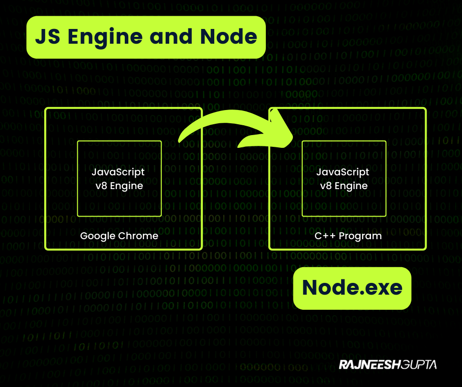

# What is Node?

Node is an open-source runtime enviornment for executing Javascript code outside of a browser.

It is used to build the API(Application prgramming Interface) to enable client application like Web App and Mobile App to talk to Back-end services.


## But Why NodeJS?
There are several back-end frameworks and modeuls such as Django, ASP.NET still NodeJS popular because of three reasons:

<!-- UL -->
* **Fast and highly scalable**: Used by organizations such Paypal, Uber, Wallmart etc
*  **Use JavaScript**: It allows front-end developers who know JavaScript, it's easy for them to get started with a brand new projects and also get them grow their career faster.
*  **Benefits of Large Open-Source Libs**: NodeJS has got the largest ecosystem of open-source code on Github as a result, you get better support.

## Node Architecture

In 2009, Ryal Dahl(creator of Node) thought why if we can take out Javascript from client-side and run it on server side to deliver same flexibility.

So he took Google Chrome v8 JavaScript Engine and embedded inside a C++ code and named this program Node.exe. 




## Capabilities of NodeJS

We cant use document or window object such as

~~document.getElementById()~~

Instead, we have objects:

```javascript

fs.access(path[, mode], callback)
dir.path
dir.read()
os.hostname()
os.platform()


```


