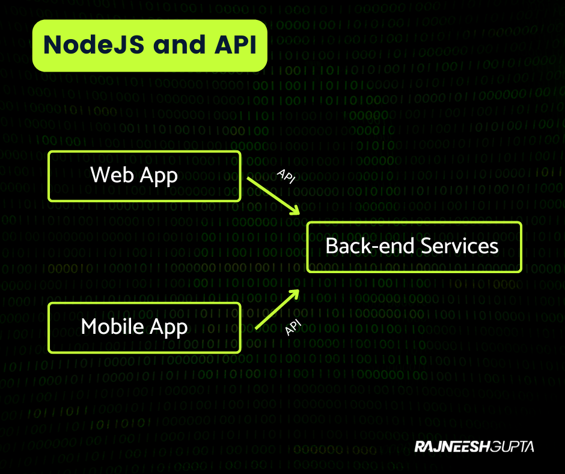

## What is Node?

Node is an open-source runtime enviornment for executing Javascript code outside of a browser.

It is used to build the API(Application prgramming Interface) to enable client application like Web App and Mobile App to talk to Back-end services.

